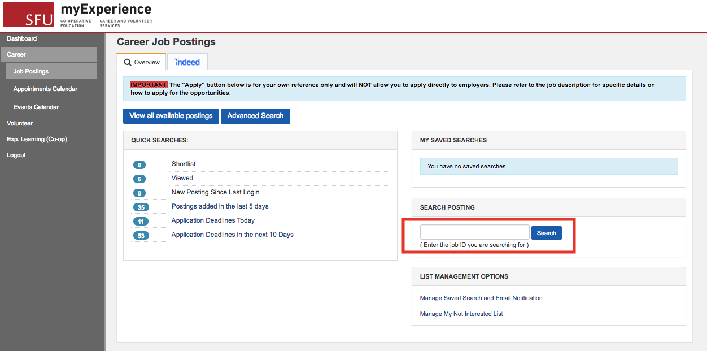

# Example Heuristic Evaluation: SFU myExperience website

*Figure 1. myExperience Career Job Postings page, with the Job Postings search box highlighted.*

## Name
- SFU myExperience Career: Job Postings search box is limited to 5 digit job ID

## Problem/Good
- Problem

## Relevant Heuristic
- Recognition rather than recall

## Evidence of issue
- The search box on the Career Job Postings page only accepts searches based on job ID.

## Detailed explanation
- When a user wishes to search for job postings via the search text box on the Career Job Postings page, they can only search by job ID. This violates the heuristic of recognition rather than recall, because it forces the user to remember the job ids from the job listings page. Moreover, since job ids are typically five digits in length, a considerable strain is put on the user to remember such ids.

## Severity (minor, major, critical)
- 4 - Critical

## Justification

### Frequency
- This issue comes with relatively low frequency. That is, users are likely to give up using the job id search text box entirely since to use it the user must memorize the job ids. Therefore, the search text box is rarely used.

### Impact
- This is a very difficult issue to overcome because to make use of the search a user must memorize each job id and the posting to which it refers. Not only that, if the user incorrectly recalls just one digit from the job id an error will also be returned.

### Persistence
- This is not a one-time problem, because users will be continually bothered by the virtually unusable search option. That is, the text box search somewhat misleads users since searching in this way is preferable but frustrates users at the same time since only job ID can be searched.

### Weighting
- This issue has a high degree of impact and persistence. Even though the issue occurs with low-frequency, this is only because the issue effectively prevents a user from using what would be an otherwise popular search option. Therefore, this issue is deserving of a severity rating of four.